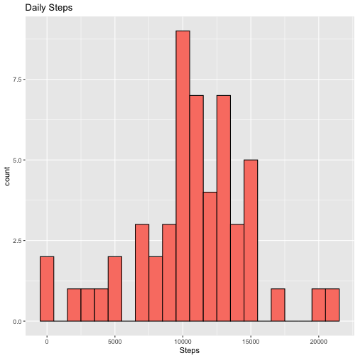
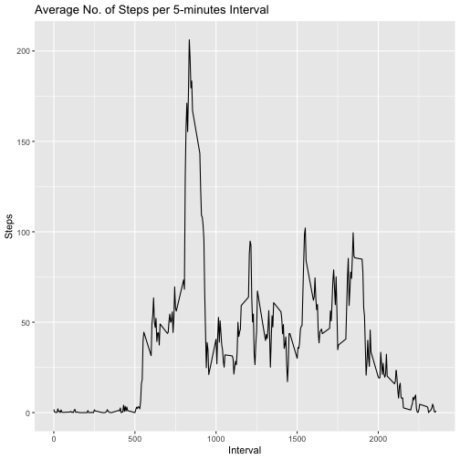
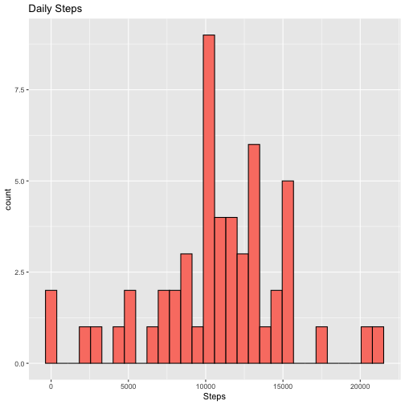
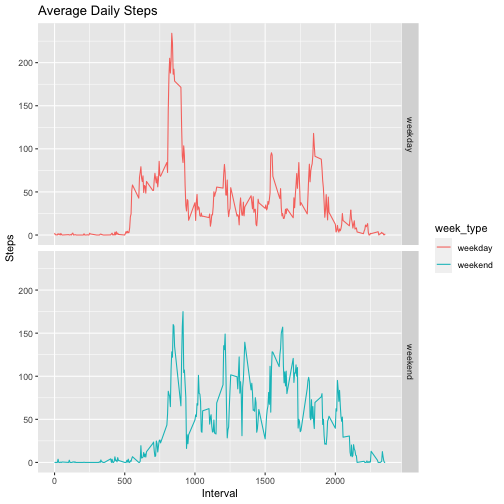

## Loading and preprocessing the data
Load the data (i.e. read.csv())


```r
library(dplyr)
library(ggplot2)

unzip('activity.zip')
activity <- read.csv('activity.csv', colClasses = c('integer', 'Date', 'integer'))
head(activity)
```

```
##   steps       date interval
## 1    NA 2012-10-01        0
## 2    NA 2012-10-01        5
## 3    NA 2012-10-01       10
## 4    NA 2012-10-01       15
## 5    NA 2012-10-01       20
## 6    NA 2012-10-01       25
```


## What is mean total number of steps taken per day?
Calculate the total number of steps taken per day

```r
totalsteps <- aggregate(steps~date, activity, FUN = sum, na.rm = TRUE)

head(totalsteps)
```

```
##         date steps
## 1 2012-10-02   126
## 2 2012-10-03 11352
## 3 2012-10-04 12116
## 4 2012-10-05 13294
## 5 2012-10-06 15420
## 6 2012-10-07 11015
```

Make a histogram of the total number of steps taken each day

```r
ggplot(totalsteps, aes(x = steps)) + 
  geom_histogram(fill = 'salmon', col = 'black', binwidth = 1000) + 
  labs(title = 'Daily Steps', x = 'Steps')
```



Calculate and report the mean and median of the total number of steps taken per day

```r
mean(totalsteps$steps, na.rm = TRUE)
```

```
## [1] 10766.19
```

```r
median(totalsteps$steps, na.rm = TRUE)
```

```
## [1] 10765
```
The mean value is 10766.19, and the median value is 10765.


## What is the average daily activity pattern?
Make a time series plot (i.e. type = "l") of the 5-minute interval (x-axis) and the average number of steps taken, averaged across all days (y-axis)

```r
averageinterval <- activity %>% group_by(interval) %>% summarise(steps = mean(steps, na.rm = TRUE))

ggplot(averageinterval, aes(x=interval, y=steps)) + geom_line() + 
  labs(title = 'Average No. of Steps per 5-minutes Interval', x = 'Interval', y = 'Steps')
```



Which 5-minute interval, on average across all the days in the dataset, contains the maximum number of steps?

```r
averageinterval[which.max(averageinterval$steps),]
```

```
## # A tibble: 1 × 2
##   interval steps
##      <int> <dbl>
## 1      835  206.
```


## Imputing missing values
Calculate and report the total number of missing values in the dataset (i.e. the total number of rows with NAs)

```r
missingsteps <- is.na(activity$steps)

sum(missingsteps)
```

```
## [1] 2304
```

Devise a strategy for filling in all of the missing values in the dataset. Create a new dataset that is equal to the original dataset but with the missing data filled in.

```r
# Filling in all of the missing values with mean of the 5-minutes interval
activity_filled <- activity
activity_filled[missingsteps, 'steps'] <- averageinterval$steps[averageinterval$interval %in% activity_filled$interval]
```

Calculate the total number of steps taken each day.

```r
totalsteps <- aggregate(steps~date, activity, FUN = sum, na.rm = TRUE)

head(totalsteps)
```

```
##         date steps
## 1 2012-10-02   126
## 2 2012-10-03 11352
## 3 2012-10-04 12116
## 4 2012-10-05 13294
## 5 2012-10-06 15420
## 6 2012-10-07 11015
```

Make a histogram of the total number of steps taken each day and Calculate and report the mean and median total number of steps taken per day.

```r
ggplot(totalsteps, aes(x = steps)) + 
  geom_histogram(fill = 'salmon', col = 'black') + 
  labs(title = 'Daily Steps', x = 'Steps')
```

```
## `stat_bin()` using `bins = 30`. Pick better value with `binwidth`.
```



Do these values differ from the estimates from the first part of the assignment? What is the impact of imputing missing data on the estimates of the total daily number of steps?

```r
mean(totalsteps$steps, na.rm = TRUE)
```

```
## [1] 10766.19
```

```r
median(totalsteps$steps, na.rm = TRUE)
```

```
## [1] 10765
```


## Are there differences in activity patterns between weekdays and weekends?
Create a new factor variable in the dataset with two levels – “weekday” and “weekend” indicating whether a given date is a weekday or weekend day.

```r
activity_week <- activity %>% mutate('week_type' = case_when(
    weekdays(date) %in% c('Saturday', 'Sunday') ~ 'weekend',
    .default = 'weekday'
  ))

head(activity_week)
```

```
##   steps       date interval week_type
## 1    NA 2012-10-01        0   weekday
## 2    NA 2012-10-01        5   weekday
## 3    NA 2012-10-01       10   weekday
## 4    NA 2012-10-01       15   weekday
## 5    NA 2012-10-01       20   weekday
## 6    NA 2012-10-01       25   weekday
```

Make a panel plot containing a time series plot (i.e. type = "l") of the 5-minute interval (x-axis) and the average number of steps taken, averaged across all weekday days or weekend days (y-axis).

```r
day_type_activity <- activity_week %>%
  group_by(week_type, interval) %>%
  summarise(steps = mean(steps, na.rm = TRUE))
```

```
## `summarise()` has grouped output by 'week_type'. You can override using the `.groups` argument.
```

```r
ggplot(day_type_activity, aes(x = interval, y = steps, color = week_type)) +
  geom_line() + facet_grid(rows = vars(week_type)) +
  labs(title = 'Average Daily Steps', x = 'Interval', y = 'Steps')
```


